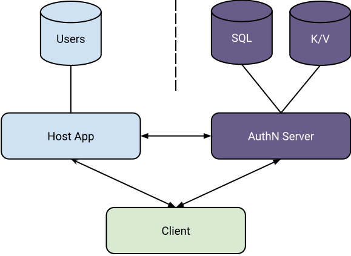

# Introduction

AuthN is an accounts microservice. It removes passwords and authentication security from your app.

An AuthN account is a login identity: username/password, plus optional connected OAuth identities.

## Why?

* **Stability:** Your application changes every day. Authentication does not.
* **Stack:** Your application is written in a language that encourages moving quickly and fixing
  things later.
* **Security:** Your application's security perimeter depends on the code your team writes and the
  code your team finds.
* **Architecture:** Your application may be small now, but when it grows up you want to be ready.

## Integration Diagram



#### AuthN Server

* Owns all accounts (credentials) data.
* Communicates directly with client to reduce host app's exposure to password data and session tokens in transit.
* Relies on SQL database (PostgreSQL, MySQL, SQLite) for long-term accounts and credentials data.
* Relies on key/value database (Redis) for sessions, metrics, and ephemeral storage.

#### Host App

* Owns all user data (not credentials). Every user has one AuthN account ID.
* Extracts AuthN accountID from access token to identify user after verifying token using public key cryptography.
* Sends emails like password resets when prompted by AuthN.
* Integrates admin functionality like account locking and archival against private AuthN endpoints.

#### Client

* Only sends password data to AuthN, in exchange for a refresh token and an access token.
* Only sends access token to host app, limiting host app's exposure and responsibilities.
* Periodically refreshes access token from AuthN server.

## Users and Accounts

AuthN manages accounts. When an account logs in, your application receives a token containing the
account's ID. You can save that account ID into your users table along with any other bits of data
that you need like names, time zones, and newsletter preferences.

Integrating AuthN tokens into a typical Ruby on Rails controller with the
[authn-rb client](https://github.com/keratin/authn-rb) requires only a few lines:

```ruby
class ApplicationController
  private

  def logged_in?
    !! current_user
  end

  def current_user
    @current_user ||= current_account_id && User.find_by_account_id(current_account_id)
  end

  def current_account_id
    # if your client sends a cookie named "authn" containing the access token
    Keratin::AuthN.subject_from(cookies[:authn])
    # OR if your client uses localStorage and sends an Authorization header
    (request.headers['Authorization'] || '').sub(/^Bearer /, '')
  end
end
```
